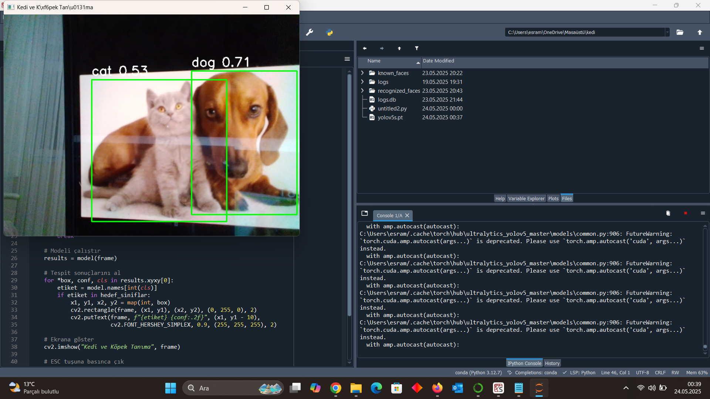

# YOLOv5 ile Gerçek Zamanlı Kedi ve Köpek Tanıma

Bu proje, PyTorch tabanlı YOLOv5 modeli kullanılarak gerçek zamanlı olarak kamera görüntüsünden **kedi** ve **köpek** nesnelerini tespit etmeyi amaçlamaktadır.

---

## 🎯 Projenin Amacı

Evcil hayvan izleme, veteriner teknolojileri, güvenlik sistemleri veya hayvan davranış takibi gibi uygulamalarda kullanılabilecek, kamera ile kedi ve köpek tespiti sağlayan temel bir nesne tanıma sistemidir.

---

## 👥 Hedef Kitlesi

- Yapay zeka ve bilgisayarla görmeye ilgi duyan öğrenciler
- YOLO modeliyle nesne tespiti öğrenmek isteyen geliştiriciler
- Görüntü işleme alanında örnek proje arayanlar

---

## ⚙️ Kullanılan Teknolojiler

- **Python**
- **YOLOv5 (ultralytics)**
- **OpenCV**
- **PyTorch**
- **Torch Hub** üzerinden model yükleme

---

## 🛠️ Kurulum Adımları

### Gerekli kütüphaneler:

```bash
pip install torch torchvision torchaudio
pip install opencv-python
```

> YOLOv5 modeli `torch.hub` üzerinden otomatik indirilir: `ultralytics/yolov5`

### Ekstra:

Python sürümü **3.7–3.10** arası önerilir. CUDA destekli GPU varsa otomatik kullanılır.

---

## ▶️ Kullanım Talimatı

### 1. Python dosyasını çalıştır:

```bash
python yolohayvantespit.py
```

### 2. Kamera açıldığında:

- Kedi veya köpek tespit edilirse, yeşil kutu ve `etiket + güven skoruyla` birlikte ekranda gösterilir.
- Programdan çıkmak için `ESC` tuşuna basmanız yeterlidir.

---

## 🖼️ Örnek Ekran Görüntüleri

Aşağıda projenin çalışmasından alınmış örnek çıktı yer almaktadır:



---

## 👨‍💻 Katkı Yapanlar

| İsim              | Öğrenci No     |iş Bölümü
|-------------------|----------------|----------
| Hasan Can Köse    | 2405902019     |proje konusu,Qr,github
| Ebru Ergül        | 2405902033     |proje konusu,poster,readme

---

## 📄 Lisans

Bu proje eğitim ve araştırma amaçlı olarak MIT Lisansı ile paylaşılmıştır.

---

## 📂 Dosya Yapısı

```
📦 Proje Klasörü
├── yolohayvantespit.py
├── kedi-köpek.png
├── README.md
```
